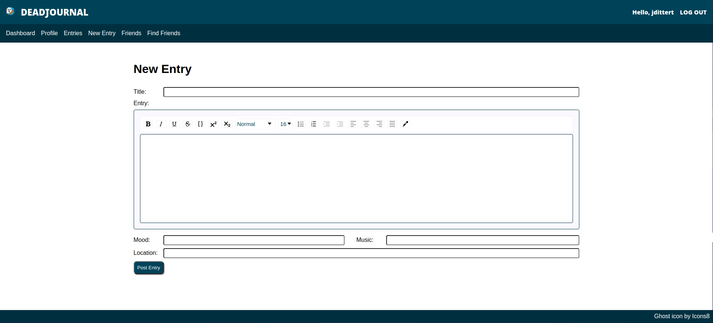

# DeadJournal

## Description
[DeadJournal](https://deadjournal-7c23e.web.app) is a clone of [LiveJournal](http://www.livejournal.com) I created as my final project for the JavaScript section of 
[The Odin Project](http://www.theodinproject.com). I chose to clone LiveJournal both because I used to enjoy using the site and because none of the other 'top projects'
copied the site. 

This project was bootstrapped with [Create React App](https://github.com/facebook/create-react-app).

In addition to React, this project also incorporates [Firebase](https://firebase.google.com/), [Firestore](https://firebase.google.com/products/firestore), 
[draft.js](https://draftjs.org/), [react-draft-wysiwyg](https://github.com/jpuri/react-draft-wysiwyg), [badwords](https://github.com/web-mech/badwords), and 
[DOMPurify](https://github.com/cure53/DOMPurify). 

I mainly followed [this tutorial](https://www.youtube.com/watch?v=PKwu15ldZ7k&ab_channel=WebDevSimplified) from Web Dev Simplified in setting up Firebase authentication.

## Features
- Users can log in and create/update user profiles.
- Users can update their email and/or password from their dashboard.
- Users can compose journal entries with a rich text editor.
- Users can follow other accounts and read journal entries from those accounts on the "Friends" page.
- Users can "like" posts. Posts display total number of likes.
- Users can comment on posts.
- Users can search for other users to follow by username. 

## Possible Future Features
- Ability to upload user profile pics.
- Ability to edit journal entries.
- Broader search results when searching for other users.
- Email alerts when friends post or comment on your posts.
- Dashboard auto-populates with new posts from friends and/or new comments.
